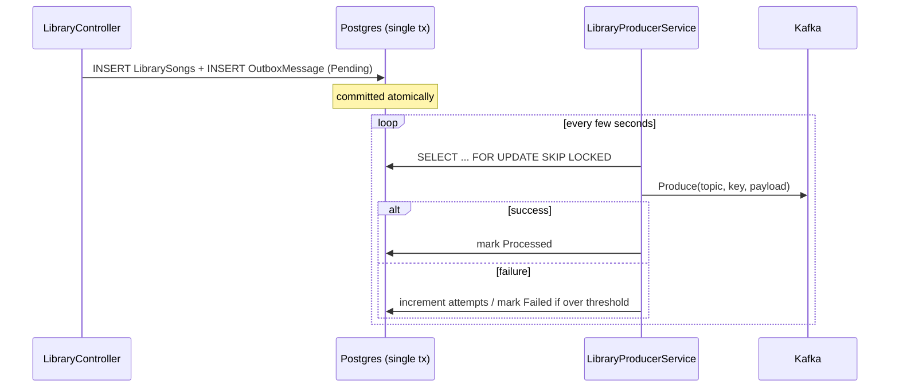

# Music.Library

LibraryService — manages per-user song libraries in the [Music Microservices](https://github.com/lucatam05/Music_Compose) project. Every user gets exactly one library, created automatically on registration.

> Looking to run the full stack? Start from [Music_Compose](https://github.com/lucatam05/Music_Compose).

## Responsibilities

- Add / remove songs from a user's library
- Look up song details for a library by calling CatalogueService
- Notify UserService asynchronously whenever a library changes, so it can keep an aggregate song count in sync

## Project layout

```
Music.Library.WebApi        → HTTP API, DI composition root, resilience/health/logging/outbox wiring
Music.Library.Business       → use cases
Music.Library.Repository     → EF Core + Postgres, outbox table & polling logic
Music.Library.Shared         → DTOs & Kafka event contracts, published as a NuGet package (consumed by UserService)
```

## Communication

- **Synchronous** — `LibraryService → CatalogueService` over HTTP, to fetch song details. All calls are `GET`s, so automatic retries on transient failures are safe (no risk of duplicated writes).
- **Asynchronous** — `LibraryService → Kafka → UserService`, publishing `song-added-to-library` / `song-removed-from-library` events whenever a library changes.

## Transactional outbox

The Kafka publish is **never** performed directly from the request path. Instead:

1. When a song is added/removed, the domain change (the `LibrarySongs` row) and an `OutboxMessage` row (the serialized event, still un-published) are written in the **same database transaction** — so they succeed or fail together, by construction.
2. A background poller (`LibraryProducerService`, running every few seconds) picks up pending outbox rows using `SELECT ... FOR UPDATE SKIP LOCKED` (safe even if the service is ever scaled to multiple instances), publishes each to Kafka, and marks it `Processed`.
3. If publishing fails, the message stays `Pending` and is retried on the next cycle. After a configurable number of failed attempts it's marked `Failed` instead of being retried forever — functioning as a dead-letter state within the same table, inspectable via a normal query.
4. Successfully published messages older than a configurable retention period are periodically deleted.

This means a Kafka/broker outage never causes a lost event or a silent DB/Kafka mismatch — the event is durably queued and will eventually be published once Kafka is reachable again.



Configuration (`Outbox` section): `BatchSize`, `MaxAttempts`, `RetentionDays`, `CleanupEveryNCycles`.

## Resilience

Calls to CatalogueService go through a Polly pipeline tuned for internal, Docker-network traffic (`LibraryResilienceExtensions`): retry with a 200ms initial backoff, circuit breaker over a 20s window that breaks for 10s, 3s per-attempt / 10s total timeout.

## Observability

- **Structured logging** via Serilog, enriched with `ServiceName` and `CorrelationId`
- **Correlation ID**: read from the incoming `X-Correlation-Id` header (or generated if absent), propagated to outbound HTTP calls to CatalogueService *and* embedded in the outbox event payload, so UserService's logs for the same request chain can be correlated too
- **Health check** — `GET /health`:
  - `database`: Postgres connectivity
  - `kafka`: broker reachability (via cluster metadata, with its own short timeout so the check fails fast rather than hanging)

## API

Base route: `/Library` — all routes require a JWT (`Authorization: Bearer <token>`) except where noted.

| Method | Route | Description |
|---|---|---|
| GET | `/Library/GetLibrary` | Get the current user's library |
| POST | `/Library/AddSongToLibrary?songId=` | Add a song (Spotify ID) to the library |
| DELETE | `/Library/RemoveSongFromLibrary?songId=` | Remove a song from the library |
| POST | `/Library/RenameLibrary?nome=` | Rename the library |

`CreateLibrary` is an internal-only endpoint (hidden from Swagger), called by UserService on registration.

## Configuration

| Setting | Purpose |
|---|---|
| `ConnectionStrings:DefaultConnection` | Postgres connection string |
| `Services:Catalogue` | Base URL of CatalogueService |
| `Kafka:ProducerClient:BootstrapServers`, `Kafka:AdminClient:BootstrapServers` | Kafka broker address |
| `Kafka:ProducerService:DelaySeconds` / `IntervalSeconds` | Outbox poller cadence |
| `Outbox:*` | Outbox batch size, max retry attempts, retention |
| `Jwt:*` | Token validation parameters (shared secret with UserService) |

In the full stack, all of this is wired via `Music_Compose`'s `docker-compose.yml` and `.env`.

## Local development

```bash
dotnet restore
dotnet ef database update --project Music.Library.Repository --startup-project Music.Library.WebApi
dotnet run --project Music.Library.WebApi
```

Requires a running Postgres and Kafka instance, and CatalogueService reachable (see [Music_Compose](https://github.com/lucatam05/Music_Compose) for the easiest way to get a full local environment up).
